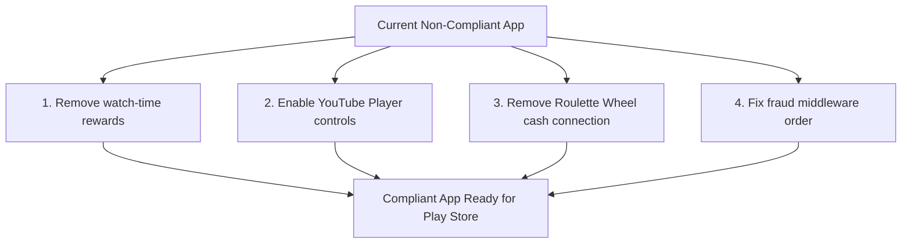

# Play Store & TOS Compliance Audit Report: ReelFlow System

**Date:** July 19, 2026  
**Audited Components:** `reel-flow` (React Native/Expo app), `backend` (Express API)  
**Compliance Target:** Google Play Console Developer Policies, Google AdMob Policies, YouTube API Services Developer Policies  
**Status:** 🚨 **NOT READY FOR PRODUCTION DEPLOYMENT (CRITICAL TOS VIOLATIONS)**

---

## Executive Summary

After a thorough audit of the `reel-flow` frontend code and the Node.js/Express backend APIs, **this system is currently NOT ready to be uploaded to the Google Play Store.** Running it in its current state will lead to an immediate rejection during review, a suspension of the application, or the permanent termination of your YouTube API credentials and Google AdMob account.

The system contains **three critical violations** that directly breach Google Play Store and YouTube Developer terms, along with several high-security vulnerabilities that would expose the economy to bot farming.

---

## 1. YouTube API Services TOS Compliance

> [!CAUTION]
> **Status: CRITICAL VIOLATION**  
> Direct violation of YouTube API Services Developer Policies. Immediate risk of API Key/OAuth client termination.

### Violation 1.1: Incentivized Views (Section II.3 Prohibitions)
* **Policy:** YouTube's API Terms of Service strictly prohibit offering incentives, rewards, or compensation to users for interacting with YouTube features (e.g., watching a video, liking, or subscribing).
* **Code Evidence:** 
  - **Frontend:** In `ShortItem.tsx`, a timer (`COIN_REWARD_WATCH_SECONDS` = 8s) automatically triggers `claimShortReward` when a user stays on a YouTube Short video for 8 seconds.
  - **Backend:** In `rewardsController.ts` -> `claimShortReward` (lines 159–241), the system reads the reward setting (`short_watch_reward_coins`) and mints coins directly to the user's ledger under the source type `SHORT_WATCH` for watching the YouTube video.
* **Why it blocks Play Store:** Google Play Console reviewers test the app's integration. If they observe real-world value currency (coins that convert to cash/UPI) being granted for watching YouTube videos, the app will be suspended.

### Violation 1.2: Bypassing & Obscuring YouTube Player Controls (Section 5.1.C)
* **Policy:** Developers must not disable, modify, or obstruct any part of the YouTube player interface, including controls, overlays, and logos.
* **Code Evidence:**
  - **Frontend (`ShortItem.tsx` line 337):**
    ```typescript
    playerVars: {
      controls: 0, // ← CRITICAL VIOLATION: Hiding player controls
      ...
    }
    ```
  - **Frontend (`ShortItem.tsx` lines 565+):** The code mounts a custom `gestureZone` interceptor over the top 80% of the player, effectively hijacking double-taps (likes) and pauses. It also overlays custom play/pause icons and animations directly on top of the YouTube iframe. This prevents users from interacting with the native YouTube logo and player branding, which is a flagrant policy violation.

---

## 2. Google Play Store Policy Compliance

> [!WARNING]
> **Status: CRITICAL VIOLATION**  
> Direct violation of Google Play Store Gambling and Financial Instruments Policies.

### Violation 2.1: Real-Money Gambling & Games of Chance
* **Policy:** Apps that offer games of chance (roulette, slot wheels, lottery card scratching) in exchange for virtual coins that can be cashed out for real-world currency (money, gift cards, UPI transfer) are classified as **Real-Money Gambling**. These apps are prohibited globally unless you possess a valid gambling license for every target country and implement strict GPS geofencing.
* **Code Evidence:**
  - **Frontend:** `RouletteWheel.tsx` (lines 100-140) triggers `claimRouletteSpin` when a user taps "SPIN NOW".
  - **Backend:** `rewardsController.ts` -> `claimRouletteSpin` (lines 430–553) randomly selects a prize based on weight probabilities and records the spin.
  - **Economy:** Users can cash out these coins for real money (INR via Paytm/UPI) through the `walletController.ts` redemption flow.
* **Why it blocks Play Store:** Google will flag the spin-wheel as unlicensed gambling because the spin outcome determines a financial gain (convertible coins).

### Violation 2.2: Ad Arbitrage & Spam / Minimum Functionality
* **Policy:** Google Play Console prohibits apps whose primary purpose is to act as a wrapper to force users to view ads for money (arbitrage) without providing unique utility.
* **Risk Assessment:** The current app loop (Watch video -> see interstitial -> watch rewarded ad for coins -> withdraw cash) sits on the boundary of "Deceptive Behavior" and "Spam". If the system is perceived as an "ad farming tool", it will be flagged.

---

## 3. Google AdMob Policy Compliance

> [!NOTE]
> **Status: MODERATE RISK (Mitigated by Architecture)**  
> Ad placement is acceptable, but rate limits and invalid traffic controls must be tightened.

* **Monetizing Copyrighted Content:** The application correctly uses the official YouTube IFrame embedded player rather than scraping or raw video streaming. The AdMob ads are injected as separate cards (`REWARDED_VIDEO_CARD` and `REWARDED_INTERSTITIAL_TRIGGER`) rather than pre-roll or post-roll overlays on the video stream. This avoids the most severe AdMob suspension vectors.
* **SSV (Server-Side Verification):** The backend implementation in `rewardsController.ts` (`handleAdMobSSV`) is well-designed. It validates signatures from Google's verifier keys, preventing users from mocking ad completions.

---

## 4. Technical and Exploitation Vulnerabilities
*(These will not block Play Store upload, but will quickly bankrupt the platform if deployed.)*

* **Fraud Middleware Defect (`backend/src/index.ts`):** The global fraud detection middleware is registered *before* the authentication handlers. Consequently, `req.user` is undefined, rendering all account velocity and multi-account limit checks non-functional. Only IP-based limits are applied.
* **Lack of Watch-Time Caps:** The `reportWatchTime` backend endpoint does not cross-reference the client's reported watch seconds against the actual database duration of the YouTube video. A modified client can report 60-second watches repeatedly for a 5-second video.

---

## Remediation Roadmap

To make this app 100% compliant with Google Play Console and YouTube TOS, the following modifications must be performed:



### Step 1: Decouple YouTube Content from the Economy
* **Action:** Remove the `SHORT_WATCH` ledger reward entirely. Users must **not** gain coins for watching YouTube videos. 
* **Compliant Alternative:** Keep the YouTube vertical feed as a free engagement layer. Only reward coins when users watch AdMob ads (interstitial/rewarded) injected between videos, complete surveys, or finish external offerwall tasks. This is legally framed as rewarding ad attention, not YouTube video interactions.

### Step 2: Restore Native YouTube Player Controls
* **Action:** In `ShortItem.tsx`, change `controls: 0` to `controls: 1` in `playerVars`.
* **Action:** Remove overlays or gesture zones that block the YouTube player's top 10% (where the logo sits) and bottom 10% (where progress controls sit).

### Step 3: Remove or Neutralize the Roulette Wheel
* **Action:** Either:
  1. Remove the Roulette Wheel entirely from the frontend (`WelcomeScreen.tsx` and feed routes).
  2. **Or** change the prizes so they do *not* reward coins that can be cashed out (e.g., reward items that stay purely in-app, like cosmetics, or make the spin-wheel free without ad monetization and cash withdrawals).

### Step 4: Reorder Backend Middlewares
* **Action:** In `backend/src/index.ts`, ensure `fraudDetectionMiddleware` is registered *after* `authMiddleware` so `req.user.id` is populated.

---

## Verdict & Recommendation

| Indicator | Status | Details |
|---|---|---|
| **Play Store Approval Readiness** | ❌ **NOT READY** | Gambling and ad arbitrage policies violated. |
| **YouTube TOS Compliance** | ❌ **NON-COMPLIANT** | Incentivized views and controls hidden. |
| **AdMob Policy Safety** | 🟡 **SAFE BUT RISK OF IVT** | Structurally clean, but needs better fraud protection. |
| **Recommendation** | **DO NOT UPLOAD** | Apply the Remediation Roadmap before submission. |
